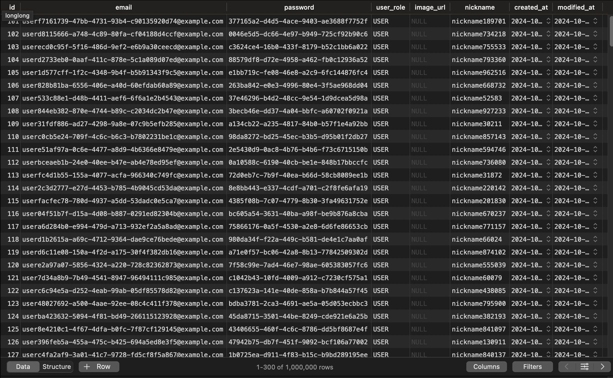

# SPRING PLUS
## aws
### ec2
* health check api: http://43.200.156.148:8080/health

### s3

### rds

## 대용량 데이터 처리

* users 테이블 100만건 insert
* nickname 필드에 index 적용

### before
* 318ms

### after
* 1ms
